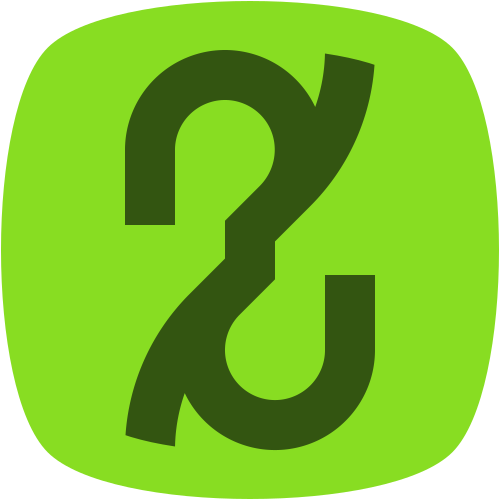

<p align="center">
    <a href="https://lucianofelix.com.br/XAR" target="_blank" rel="noopener noreferrer">
        
    </a>
</p>

<h1 align="center">XAR</h1>
<p align="center">
    Custom LCD Characters editor
</p>


## The app


Access at [LucianoFelix.com.br/XAR](https://lucianofelix.com.br/XAR/)

## Arduino example

```c++
#include <LiquidCrystal.h>

LiquidCrystal lcd(12, 11, 5, 4, 3, 2);

// Custom character binaries (Put your code in the brackets)
byte hearth[8] = {0x00, 0x0A, 0x1F, 0x1F, 0x0E, 0x04, 0x00, 0x00};

void setup() {
    // Custom character registration
    lcd.createChar(0, hearth);

    lcd.begin(16, 2);
    
    // Draws the custom character
    lcd.write(byte(0));
}

void loop() {}

```

> Create a custom character (glyph) for use on the LCD. Up to eight characters of 5x8 pixels are supported (numbered 0 to 7). The appearance of each custom character is specified by an array of eight bytes, one for each row. The five least significant bits of each byte determine the pixels in that row. To display a custom character on the screen, write() its number.

See [LiquidCrystal reference](https://www.arduino.cc/en/Reference/LiquidCrystal).

## License
This project is [MIT licensed](https://github.com/FelixLuciano/XAR/blob/main/LICENSE).
